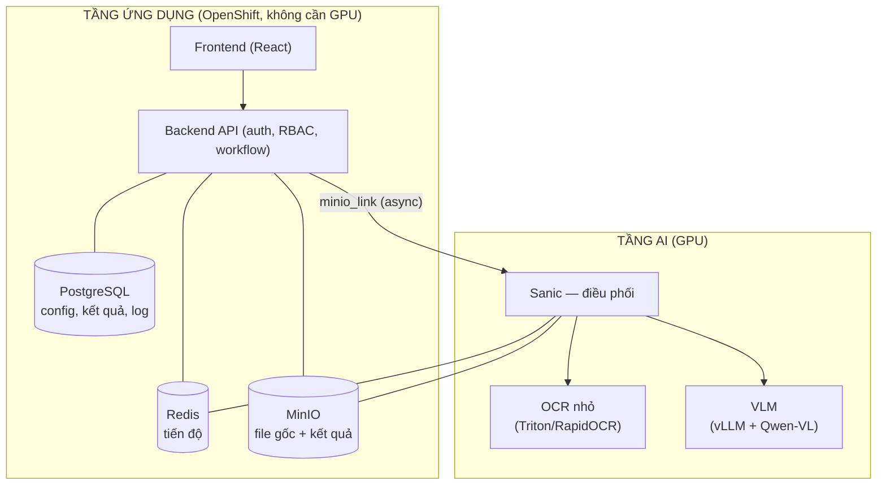
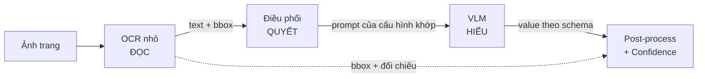
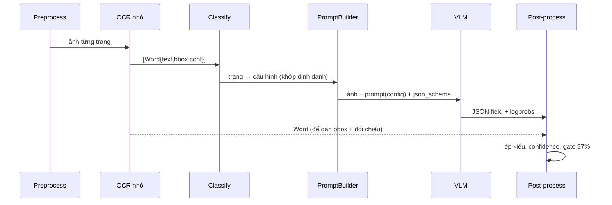

# Kiến trúc hệ thống VCB OCR

## 1. Ý nghĩa: đây không phải "đọc chữ", mà là "biến giấy thành dữ liệu tin cậy"

OCR chỉ là một mắt xích. Bài toán thật: **biến hồ sơ giấy thành dữ liệu có cấu trúc, đủ tin
cậy để hệ thống nghiệp vụ dùng trực tiếp — không cần nhập tay.** Ba trụ cột:

- **Config-driven** — người nghiệp vụ khai báo schema (trường, mô tả, kiểu). Prompt cho AI
  được *sinh ra* từ khai báo đó. Thêm loại giấy = thêm cấu hình, không train, không deploy.
- **Human-in-the-loop** — AI trả kèm confidence; chỉ trường "không chắc" mới cần người xem.
- **Giải thích được** — mỗi giá trị trỏ về vị trí gốc (bounding box) trên ảnh.

## 2. Hai tầng



**Vì sao tách?** GPU đắt và khan. Tầng ứng dụng scale theo số người dùng (rẻ, nhiều pod);
tầng AI scale theo tải GPU (đắt, ít pod). Tách ra thì nâng cấp model không đụng nghiệp vụ.

> Repo này là **tầng AI + pipeline lõi**. Tầng ứng dụng (Sanic API/Redis/MinIO) sẽ bọc sau.

## 3. Ba vai — nguyên tắc nền tảng



| Vai | Ai | Trả lời câu hỏi | Đặc điểm |
|---|---|---|---|
| **ĐỌC** | OCR nhỏ (Triton/RapidOCR) | "có chữ gì, ở đâu?" | mù nghĩa; nhanh, rẻ; cho **bbox** chính xác |
| **QUYẾT** | Điều phối (Sanic) — code thuần | "trang này là mẫu gì?" | rule, giải thích được; không AI |
| **HIỂU** | VLM (Qwen-VL) | "chữ nào là field nào, giá trị đúng?" | hiểu ngữ cảnh, bảng; chậm, đắt |

**Câu chốt:** OCR đọc — Điều phối quyết — VLM hiểu.

### Vì sao cần cả OCR nhỏ lẫn VLM?
OCR chỉ cho *chữ*, không cho *ý nghĩa*. "Lấy value theo nhãn" (rule-based) chỉ chạy cho form
cố định — gục khi tài liệu đa dạng (nhãn viết muôn kiểu, value nằm chỗ khó đoán, cần suy
luận như bỏ "Bà", đổi định dạng ngày, ghép địa chỉ, đọc bảng). VLM lấp khoảng trống ngữ
nghĩa đó. Ngược lại, VLM tự sinh toạ độ không đủ chính xác để vẽ khung, và tự chấm điểm thì
vô nghĩa — nên vẫn cần OCR cho **bbox** và **đối chiếu chống bịa**.

### OCR nhỏ được dùng ở NHIỀU nơi (một lần đọc, nhiều nơi dùng)
1. **Phân loại trang** — khớp *trường định danh* để chọn cấu hình → chọn prompt.
2. **bbox** — khoanh vùng khi hậu kiểm.
3. **Đối chiếu confidence** — value của VLM có khớp text OCR không (field số/mã).
4. *(tùy chọn)* **Mỏ neo trong prompt** — chỉ cho field số/mã (`use_ocr_hint`), tránh dùng
   cho chữ viết tay (VLM tự nhìn tốt hơn).

### Chọn OCR nào cho tiếng Việt (kết luận từ đánh giá thực nghiệm)
Đã thử trên sổ đỏ (chi tiết `eval/`):

| | Tesseract `vie` | RapidOCR/PP-OCR mặc định |
|---|---|---|
| Dấu tiếng Việt | ✅ đọc đúng | ❌ **lột sạch dấu** (recognizer Trung+Latin) |
| Số/mã, detection, bbox, tốc độ | chậm, không bbox | ✅ tốt hơn |

→ Chất lượng tiếng Việt do **slot recognition** quyết định (detection trung tính ngôn ngữ).
**Combo PROD:** detection PP-OCR/RapidOCR + **recognition VietOCR (tiếng Việt)**. RapidOCR
mặc định chỉ dùng cho bbox + đối chiếu field số/mã; với phân loại thì khớp **bỏ dấu**
(`strip_accents` trong `core/ocr_client.py`).

## 4. Luồng pipeline chi tiết (I/O từng bước)



| Bước | Module | INPUT | OUTPUT |
|---|---|---|---|
| 1 Preprocess | `preprocess.py` | PDF/ảnh, DPI | `[(page_no, image)]` |
| 2 OCR nhỏ | `ocr_client.py` | ảnh | `[Word{text, bbox[x,y,w,h], conf}]` |
| 3 Phân loại | `classify.py` | text + định danh cấu hình | `page_no → config` |
| 4 Dựng prompt | `prompt_builder.py` | **config** + ocr_words | `prompt` + `json_schema` |
| 5 VLM | `vlm_client.py` | ảnh + prompt + schema | JSON field + `logprobs` |
| 6 Post-process | `postprocess.py` + `confidence.py` | field + logprobs + ocr_words | `{value, confidence, bbox, need_review}` |
| 7 Gộp trang | `merge.py` | kết quả các trang | document + `avg_confidence` + trạng thái |

## 5. Confidence — nền tảng của cổng tự-duyệt

**Không hỏi model tự chấm điểm** (LLM luôn trả 0.9+ kể cả khi bịa). Dùng 3 tín hiệu:

```
logprob_score = exp(mean(logprob các token của value))     # độ chắc thật của model
ocr_agreement = độ giống giữa value và text OCR             # nhân chứng độc lập
conf = 0.65*logprob_score + 0.35*ocr_agreement
if sai regex:  conf = min(conf, 0.50)                        # sai định dạng → ép người xem
need_review = conf < min_confidence (mặc định 0.97)
```

- Field tắt `use_ocr_hint` (viết tay) → không có ocr_agreement → chỉ dùng logprob.
- **Hiệu chuẩn (calibrate)**: gán nhãn tay, xem trong nhóm tự-duyệt bao nhiêu % đúng thật.
  Ngưỡng 97% là mặc định, ngưỡng đúng cho mẫu của bạn phải đo (`evaluate.py`).

## 6. Config-driven: prompt sinh từ cấu hình

`build_prompt(config)` ghép 5 khối: (1) vai trò + tên cấu hình, (2) mỏ neo OCR cho field
`use_ocr_hint`, (3) schema + **mô tả** từng field, (4) luật chống bịa, (5) khuôn JSON.

- `loai = manual/compute` → **loại khỏi prompt** (không để AI đoán trường người nhập tay).
- `mo_ta` → nạp thẳng vào khối 3. Sửa mô tả = cải thiện AI mà **không train**.
- `kieu = table` → rẽ nhánh cấu trúc prompt (trả về headers/rows).

## 7. Bảo mật (ràng buộc vì là hệ ngân hàng)

- **PII** (CCCD, sổ đỏ, BCTC) mức Bảo mật/Hạn chế → AI **stateless**, file temp tự xóa sau
  khi xong, **log làm sạch PII**.
- **Không dùng API cloud** cho VLM — private subnet, không internet trực tiếp; chỉ mở cổng
  Sanic ra ngoài, Triton/vLLM chỉ internal.
- TLS in-transit, MinIO encryption at-rest, RBAC 2 chiều (folder + chức năng).

## 8. Lộ trình

| Giai đoạn | OCR nhỏ | VLM |
|---|---|---|
| **v1 (nay)** | RapidOCR trong Python | Ollama qwen2.5vl:3b (Mac) |
| **v2 (GPU thuê)** | RapidOCR / +VietOCR rec | vLLM + Qwen3-VL-8B |
| **v3 (PROD)** | Triton (ONNX ensemble) | vLLM nhiều replica, +LoRA fine-tune |

Giữ **ranh giới sạch** (mỗi vai một module, hợp đồng I/O rõ) để đổi vỏ chỉ sửa 1 file.
