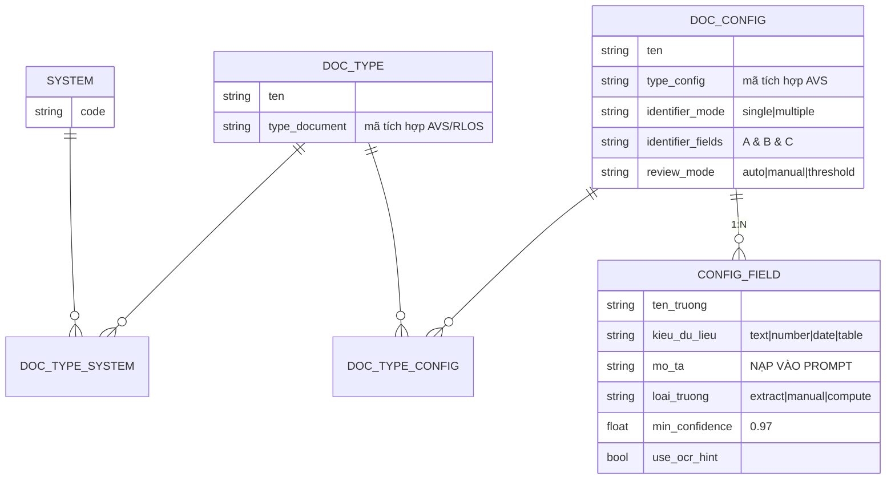
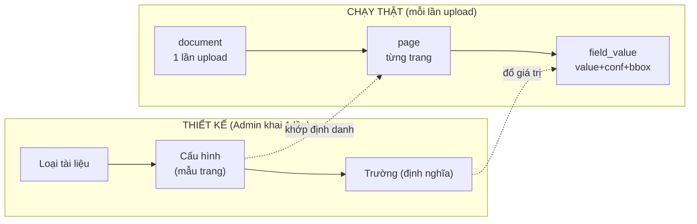

# Mô hình dữ liệu

## 1. Ba cấp + một chiều vuông góc

```
LOẠI TÀI LIỆU  = CÁI TÚI hồ sơ        "Hồ sơ vay thế chấp"
CẤU HÌNH       = MỘT MẪU TRANG        "Sổ đỏ mẫu 5 - trang 1"   ← prompt gắn ở đây
TRƯỜNG         = MỘT Ô trên trang     "so_cccd", "thua_dat_so"

HỆ THỐNG (chiều vuông góc) = ĐÍCH ĐẾN dữ liệu   "RLOS", "AVS"
```

- **Cấu hình = mẫu trang** (template), không phải "1 trang thật". Nhiều trang thật có thể
  khớp cùng 1 cấu hình (bảng BCTC dài 5 trang cùng layout).
- **Prompt gắn ở cấu hình** → phải phân loại từng trang để biết dùng prompt nào.
- **Hệ thống** không thuộc cấp nào — là chiều thứ hai, cắt ngang.

## 2. ERD



**Quan hệ quan trọng nhất: `DOC_TYPE_CONFIG` là N:N** — một cấu hình (CCCD) dùng lại ở nhiều
loại tài liệu (vay thế chấp, mở TK...). Khai một lần, dùng nhiều nơi; sửa mô tả 1 chỗ, mọi
bộ hồ sơ tốt lên. Hai màn UI ("thêm cấu hình" chọn loại TL / "thêm loại TL" chọn cấu hình)
ghi vào **cùng một bảng** này.

## 3. Ba cột của TRƯỜNG nối thẳng vào hành vi AI

| Cột | Tác dụng trong pipeline |
|---|---|
| `mo_ta` | nạp vào prompt VLM — sửa mô tả = cải thiện AI, **không train** |
| `loai_truong` | `extract`→vào prompt; `manual`→bỏ (người nhập); `compute`→bỏ (code tính) |
| `kieu_du_lieu` | ép kiểu ở post-process + chọn widget hậu kiểm; `table` rẽ nhánh prompt |
| `min_confidence` | ngưỡng tự-duyệt của **từng field** (mặc định 0.97) |

## 4. Hai nửa: THIẾT KẾ vs CHẠY THẬT



Bảng runtime cần có:
- `document` — 1 lần upload (số trang, dung lượng, trạng thái, avg_confidence).
- `page` — mỗi trang; cột `config_id` = **kết quả phân loại** (NULL = unknown).
- `field_value` — value, confidence, bbox, need_review, `value_original` (nguồn log chỉnh sửa).

## 5. Ràng buộc quan trọng phải tự code

**Trường định danh phải DUY NHẤT trong cùng một loại tài liệu.** Vì cấu hình thuộc nhiều
loại (N:N), phải kiểm từng loại. Sổ đỏ mẫu 5 và mẫu 7 cùng trong "Vay thế chấp" mà trùng
định danh → phân loại trang nhập nhằng → **sai âm thầm, không báo lỗi** (loại lỗi tệ nhất).

## 6. Schema SQL khởi động

```sql
CREATE TABLE system ( id SERIAL PRIMARY KEY, code TEXT UNIQUE, ten TEXT );

CREATE TABLE document_type (              -- CÁI TÚI
  id SERIAL PRIMARY KEY, ten TEXT NOT NULL,
  type_document TEXT NOT NULL, mo_ta TEXT, is_active BOOLEAN DEFAULT TRUE );

CREATE TABLE document_config (            -- MẪU TRANG
  id SERIAL PRIMARY KEY, ten TEXT NOT NULL, type_config TEXT NOT NULL,
  identifier_mode TEXT CHECK (identifier_mode IN ('single','multiple')),
  identifier_fields TEXT NOT NULL,
  review_mode TEXT CHECK (review_mode IN ('auto','manual','threshold')) );

CREATE TABLE config_field (               -- Ô TRÊN TRANG
  id SERIAL PRIMARY KEY,
  config_id INT REFERENCES document_config ON DELETE CASCADE,
  ten_truong TEXT NOT NULL,
  kieu_du_lieu TEXT CHECK (kieu_du_lieu IN ('text','number','date','table')),
  mo_ta TEXT, loai_truong TEXT CHECK (loai_truong IN ('extract','manual','compute')),
  formula TEXT, min_confidence NUMERIC(4,3) DEFAULT 0.970,
  use_ocr_hint BOOLEAN DEFAULT TRUE, sort_order INT,
  UNIQUE (config_id, ten_truong) );

CREATE TABLE document_type_config (       -- ⭐ N:N (một bảng cho cả hai màn UI)
  document_type_id INT REFERENCES document_type ON DELETE CASCADE,
  config_id INT REFERENCES document_config ON DELETE CASCADE,
  PRIMARY KEY (document_type_id, config_id) );

CREATE TABLE document_type_system (       -- N:N → sinh folder
  document_type_id INT REFERENCES document_type ON DELETE CASCADE,
  system_id INT REFERENCES system,
  PRIMARY KEY (document_type_id, system_id) );

-- runtime
CREATE TABLE document (
  id SERIAL PRIMARY KEY, folder_type_id INT, folder_system_id INT,
  ten_file TEXT, so_trang INT, dung_luong BIGINT,
  trang_thai TEXT, avg_confidence NUMERIC(4,3) );
CREATE TABLE page (
  id SERIAL PRIMARY KEY, document_id INT REFERENCES document ON DELETE CASCADE,
  page_no INT, config_id INT REFERENCES document_config,
  UNIQUE (document_id, page_no) );
CREATE TABLE field_value (
  id SERIAL PRIMARY KEY, document_id INT REFERENCES document ON DELETE CASCADE,
  page_id INT REFERENCES page, config_field_id INT REFERENCES config_field,
  value TEXT, confidence NUMERIC(4,3), bbox JSONB,
  need_review BOOLEAN, edited_by TEXT, value_original TEXT );
```

## 7. Cấu hình hiện tại trong repo (file, mô phỏng DB)

Ở giai đoạn này, mỗi cấu hình là 1 file `configs/*.json` — cấu trúc khớp `document_config`
+ `config_field`. Xem [`configs/sodo_m5_tr1.json`](../configs/sodo_m5_tr1.json). Khi có DB +
UID, chỉ cần thay `load_configs()` bằng truy vấn DB — pipeline không đổi.
